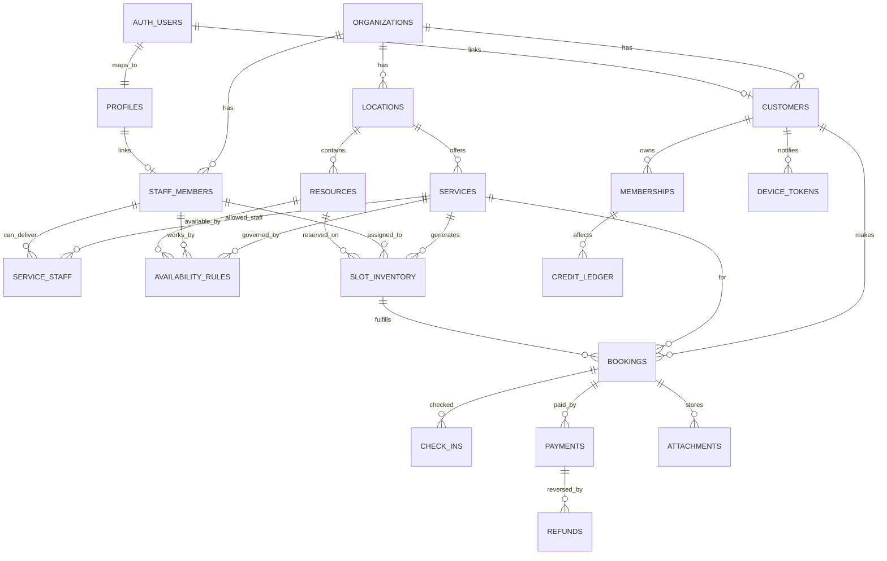
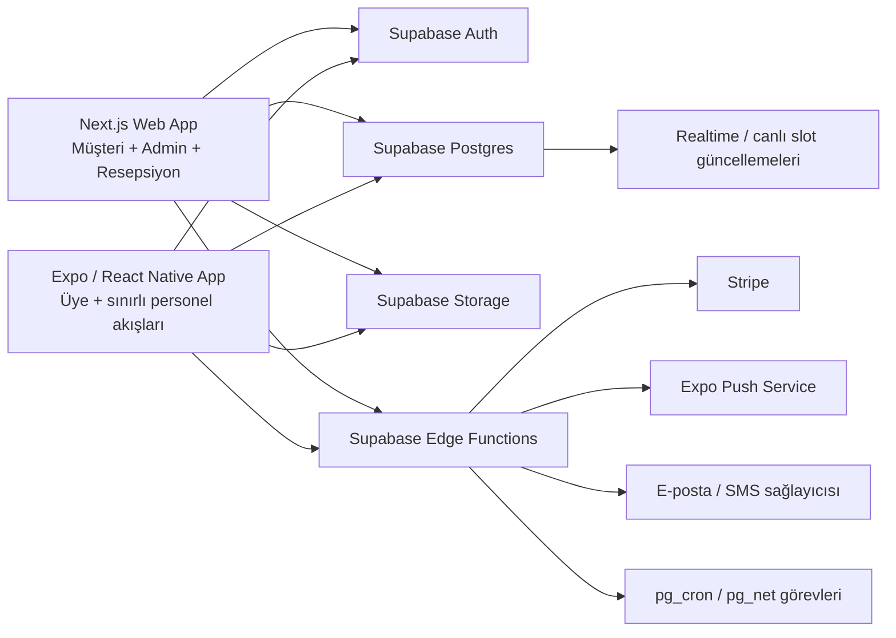
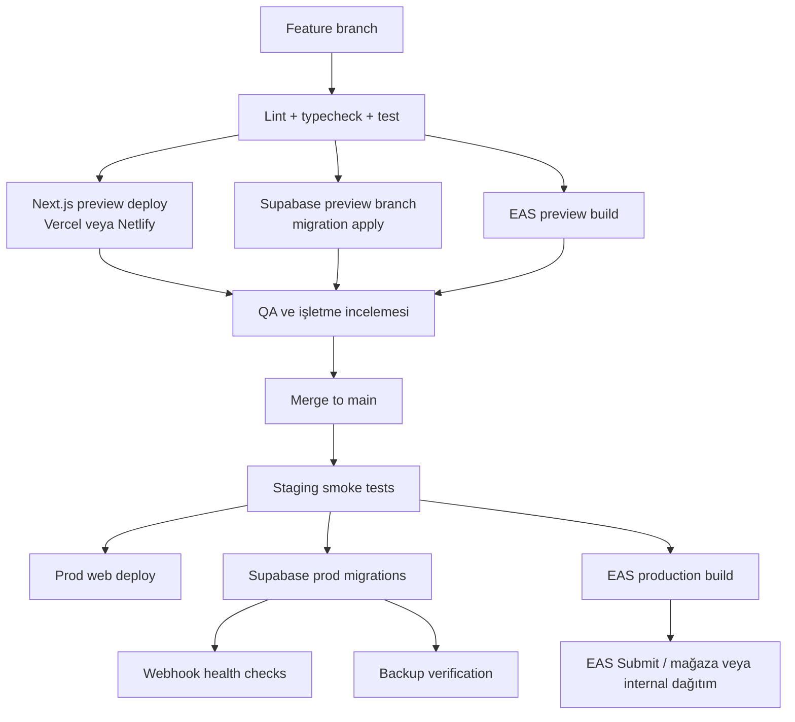
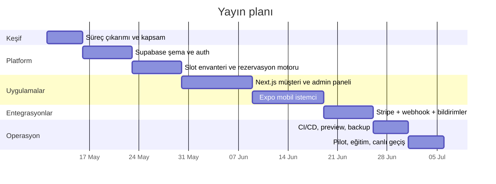
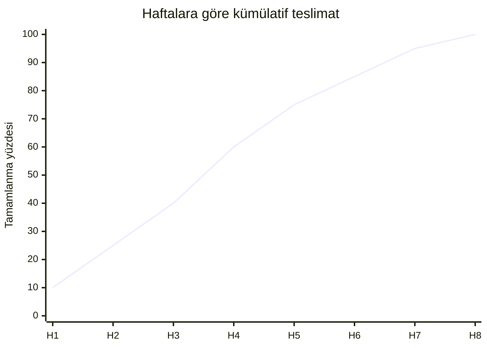

# Next.js, Supabase ve Expo ile Spor Merkezi Rezervasyon Sistemi

## Yönetici Özeti

Bu kullanım senaryosu için en düşük riskli ve en hızlı canlıya çıkabilecek çözüm, **müşteri ve operasyon web yüzeyi için Next.js App Router**, **kimlik, veritabanı, dosya depolama ve yetkilendirme için Supabase**, **mobil istemci için Expo tabanlı React Native**, **ödemeler için Stripe**, **web dağıtımı için öncelikli olarak Vercel**, alternatif olarak **Netlify**, ve **mobil derleme/yayın hattı için EAS Build + EAS Submit + EAS Update** bileşimidir. Next.js App Router dosya sistemi tabanlı bir router’dır; App Router, Server Components, Suspense ve Server Functions gibi modern React kabiliyetlerini kullanır. Supabase Auth JWT tabanlıdır ve RLS ile birlikte uçtan uca yetkilendirme sağlar; Storage tarafı da RLS ile entegredir. Expo Router dosya tabanlı gezinim sağlar; EAS Build uygulama derlemelerini, EAS Submit mağaza gönderimini, EAS Update ise `expo-updates` kullanan projelere OTA güncellemeleri destekler. Stripe’ın resmî belgeleri web için Checkout ve Payment Element, mobil için Payment Sheet ve üyelikler için Billing/Subscriptions akışlarını açıkça ayırır. Vercel ve Netlify ise preview deploy, branch context ve ortam değişkeni ayrımı için olgun akışlar sunar. citeturn14view2turn8view18turn8view2turn8view8turn8view9turn8view10turn19view0turn8view11turn9view12turn13view0turn8view16

Bu proje için önerilen **minimal MVP**, “her rol için her ekran” yaklaşımı değil, **web-first operasyon + müşteri self-service + mobil companion** yaklaşımıdır. Yani ilk sürümde yönetici, resepsiyon ve personel tarafı öncelikle web panelinde; müşteri tarafı hem web’den hem mobil uygulamadan rezervasyon yapabilir. Mobil uygulamanın ilk görevi tam operasyon ERP’si olmak değil; **rezervasyon, QR geçiş, üyelik/tek giriş görüntüleme, push bildirim ve ödeme** gibi son kullanıcı akışlarını güvenilir şekilde sunmaktır. Bu tercih, ürün karmaşıklığını düşürür, App Store/Play Store sürümünü hızlandırır ve yerel bir spor merkezi için satın alma kararını kolaylaştırır.

Teknik olarak en kritik karar, rezervasyonu yalnızca “takvimde event yaratmak” olarak değil, **kapasite ve kaynak tüketen bir envanter işlemi** olarak modellemektir. Havuz slotu kapasite tüketir; personal trainer seansı bir personel zaman bloğu tüketir; masaj seansı hem terapist hem oda tüketebilir; tek giriş ise bir hak/entitlement veya tarih bazlı erişim üretir. Bu yüzden çekirdek veri modeli, yalnızca `bookings` tablosu etrafında değil, **slot envanteri**, **üyelik/entitlement**, **ödeme girişimleri** ve **check-in kanıtı** etrafında tasarlanmalıdır. Stripe tarafında da rezervasyonun “ödendi” sayılması, istemci yönlendirmesine değil, **doğrulanmış webhook** sonucuna bağlanmalıdır. Stripe, ödeme yaşam döngüsünün PaymentIntent üzerinden izlenmesini ve ödeme durumu için webhook kullanılmasını önerir; ayrıca her sipariş ya da müşteri oturumu için yeni bir PaymentIntent/Checkout Session oluşturulmasını tavsiye eder. citeturn9view10turn9view11turn0search11turn8view12

## Varsayımlar ve Ürün Kapsamı

Bu rapor aşağıdaki varsayımlarla hazırlanmıştır:

- Çözüm ilk aşamada **tek işletme** için tasarlanır; ancak veri modeli **çok şubeli** yapıya genişleyebilir.
- Online ödeme sağlayıcısı olarak **Stripe** kullanılır.
- Donanım tarafında kapı turnikesi, kartlı geçiş, POS cihazı, SMS gateway ve yerel muhasebe entegrasyonları bu raporda **opsiyonel** kabul edilir; bunların teknik ve hukuki gereksinimleri **unspecified** olarak işaretlenmiştir.
- Müşteri tarafında **web + mobil**, operasyon tarafında ise öncelikle **web panel** bulunur.
- Uygulama, sağlık kaydı sistemi değildir. Masaj veya antrenman tarafında sadece operasyon için zorunlu olan asgari bilgi tutulur; ayrıntılı sağlık verisi işlenecekse ayrıca hukuki değerlendirme gerekir.
- Türkiye’ye özgü vergi, e-fatura, iade, tüketici hukuku, mağaza politikaları ve KVKK ayrıntıları bu raporda tam hukuk görüşü olarak ele alınmamıştır; bu başlıklar **unspecified** kabul edilmelidir.

Gizlilik ve uyumluluk açısından doğru zihniyet, “önce veri minimizasyonu” olmalıdır. entity["organization","European Commission","eu executive body"] GDPR’ın teknoloji-nötr olduğunu ve verinin otomatik ya da manuel, dijital ya da fiziksel fark etmeksizin kişisel veri ise koruma kurallarına tabi olduğunu belirtir. entity["organization","European Data Protection Board","eu privacy board"] ise veri sorumlusu ve işleyenin riskle orantılı teknik ve organizasyonel tedbirler alması gerektiğini vurgular. Bu nedenle bu proje, üyelik ve rezervasyon sistemi olarak **ad, iletişim, üyelik/ödeme ilişkisi, rezervasyon geçmişi ve check-in kanıtı** gibi operasyonel minimum veriyi tutmalı; “güzel olabilir” diye ek veri toplamamalıdır. AB’de yerleşik kullanıcıları hedefleyen veya o kullanıcıların verisini düzenli işleyen bir işletme için GDPR değerlendirmesi gerekebilir; bunun kapsamı işletmenin fiili faaliyet modeline göre ayrıca incelenmelidir. citeturn8view22turn8view23turn7search5

Kapsamı netleştirmek için ürünün iş hedefi de açık olmalıdır: Bu sistemin amacı “güzel görünen ajanda” değil, **rezervasyon, kapasite yönetimi, check-in, ödeme ve iptal/refund mantığını güvenilir biçimde işletmek** olmalıdır. Bu yüzden ilk sürümde özellikle kaçınılması gerekenler; detaylı sadakat programı, kupon motoru, çok karmaşık dinamik fiyatlama, donanım bağımlı giriş kontrol altyapısı, çok kiracılı SaaS faturalaması ve tam POS entegrasyonudur. Bunlar ikinci aşama büyüme işidir; MVP’nin omurgasını zayıflatmamalıdır.

## MVP Özellik Seti ve Veri Modeli

Önerilen minimal MVP’de dört ana hizmet senaryosu ayrı ayrı düşünülmeli, ancak tek platformda birleşmelidir: **havuz rezervasyonu**, **personal trainer seansı**, **masaj rezervasyonu**, **tek seferlik giriş**. Bunların ortak yüzeyi “müşteri bir hizmete erişim hakkı satın alır veya üyeliğiyle kullanır; sistem bir zaman, kapasite ve gerektiğinde personel/oda ayırır” mantığıdır.

Aşağıdaki tablo, önerilen minimal MVP kapsamını gösterir:

| Alan | MVP’de olmalı | İkinci faza bırakılabilir |
|---|---|---|
| Kimlik | E-posta magic link/OTP, telefon OTP, misafir akışı, personel girişleri | Sosyal girişler, kurumsal SSO |
| Rezervasyon | Slot listeleme, rezervasyon oluşturma, iptal, yeniden planlama, kapasite kontrolü | Waitlist, otomatik overbooking politikaları |
| Hizmet modeli | Havuz, PT, masaj, tek giriş | Grup dersleri, paket kampanya motoru |
| İşletme yönetimi | Şube, hizmet, personel, kaynak/oda, çalışma saatleri, blackout | Çok işletmeli SaaS yönetimi |
| Check-in | QR, üyelik kodu, manuel arama | Donanım turnike entegrasyonu |
| Ödeme | Tek ödeme, üyelik/abonelik, refund kayıtları | Yerel POS, nakit kasa entegrasyonu |
| Bildirim | Push, e-posta, temel SMS adaptörü | Pazarlama otomasyonu, segmentasyon |
| Dosyalar | Fatura/fiş, dekont, profil fotoğrafı, onam formu | Gelişmiş medya iş akışları |
| Raporlama | Günlük rezervasyon, doluluk, no-show, ödeme özeti | Gelişmiş BI ve kohort analizi |

Bu MVP’nin veri modeli, Supabase’in yönettiği tam Postgres veritabanı üzerinde kurulmalıdır. Supabase’in resmî yönlendirmesi, kullanıcı profili gibi uygulama tablolarını `public` şemasında tutmak, bunları `auth.users` ile ilişkilendirmek ve RLS ile korumaktır. Migrations SQL dosyalarıyla izlenmeli, local Supabase stack üzerinde test edilmeli ve versiyon kontrolde tutulmalıdır. citeturn9view0turn8view0turn9view2

Aşağıdaki ERD, üretime uygun minimal çekirdeği gösterir:



Bu ERD’de özellikle **`slot_inventory`** tablosu stratejiktir. Birçok ekip ilk sürümde sadece `bookings(start_at, end_at)` ile ilerlemeye çalışır; ancak havuz kapasitesi, masaj odası, terapist ve PT ajandası gibi kaynaklar devreye girdiğinde çakışma, kapasite aşımı ve iptal iadesi mantığı karmaşıklaşır. `slot_inventory`, yayınlanmış bookable slot’ların kapasitesini, atanan personeli ve kaynağı takip ederek rezervasyonu işlemleştirmeyi kolaylaştırır. Bu sayede havuz için “30 kişilik 18:00–19:00 slotu”, PT için “Ali hoca 10:00–11:00”, masaj için “Oda-2 + terapist-7 + 60 dk + 15 dk buffer” gibi senaryolar tek bir çekirdekte yönetilebilir.

Aşağıdaki tablo, çekirdek tabloları ve neden gerekli olduklarını özetler:

| Tablo | Temel kolonlar | Neden gerekli |
|---|---|---|
| `profiles` | `user_id`, `full_name`, `phone` | `auth.users` dışına uygulama profili almak için |
| `customers` | `id`, `organization_id`, `user_id`, `membership_code`, `status` | Üye ve misafir müşteri hesabını tek modelde toplamak için |
| `staff_members` | `id`, `organization_id`, `profile_user_id`, `role_kind` | Eğitmen, terapist, resepsiyon ayrımını yönetmek için |
| `services` | `service_kind`, `duration_min`, `slot_interval_min`, `capacity_mode`, `payment_mode` | Havuz/PT/masaj/tek giriş ayrımını kural tabanlı taşımak için |
| `resources` | `resource_kind`, `location_id`, `capacity` | Oda, havuz alanı, giriş kaynağı gibi fiziksel varlıkları ayırmak için |
| `availability_rules` | `subject_type`, `weekday`, `start_time`, `end_time` | Hizmet, personel ve kaynağın kullanılabilirliğini tanımlamak için |
| `slot_inventory` | `service_id`, `staff_id`, `resource_id`, `starts_at`, `capacity_total`, `capacity_reserved` | Yarış koşullarında güvenilir rezervasyon için |
| `bookings` | `customer_id`, `slot_id`, `status`, `channel`, `attendee_count` | Ticari rezervasyon kaydını tutmak için |
| `memberships` | `product_kind`, `valid_from`, `valid_to`, `remaining_credits` | Tek giriş, kredi paketi veya aboneliği taşımak için |
| `payments` | `booking_id`, `provider`, `flow`, `status`, `provider_ref` | Stripe çıkışını rezervasyon yaşam döngüsüne bağlamak için |
| `refunds` | `payment_id`, `amount`, `reason`, `status` | Kısmi/tam iade takibi için |
| `check_ins` | `booking_id`, `method`, `checked_in_at` | QR ve giriş kanıtı için |
| `attachments` | `bucket`, `path`, `owner_customer_id`, `kind` | Dekont, onam, profil görseli gibi dosyalar için |

## Kimlik, Rezervasyon ve Ödeme Akışları

Kimlik doğrulama ve fiziksel tanımlama ayrı meselelerdir; bu sistemde bunları birbirine karıştırmamak gerekir. Supabase e-posta tabanlı passwordless girişte Magic Link ve OTP’yi, telefon tabanlı girişte SMS/WhatsApp OTP’yi ve misafir/PII’siz deneyimler için anonymous sign-in akışını destekler. Ayrıca yönetici ve personel yüzeyleri için MFA eklemek mümkündür ve Supabase bunu iyi uygulama olarak açıkça önerir. Dolayısıyla önerilen model; **müşteri için passwordless giriş**, **misafir için anon/guest akışı**, **resepsiyon check-in için QR veya üyelik kodu**, **personel/admin için MFA** şeklindedir. Redirect URL yapılandırması da web ve mobil deep link akışlarının aynı auth omurgasında çalışmasını sağlar. citeturn8view21turn8view20turn8view19turn23view0turn9view7

Aşağıdaki seçenek matrisi, hangi tanımlama yöntemini nerede kullanmanız gerektiğini gösterir:

| Seçenek | Sürtünme | Güvenlik | Offline uygunluğu | Önerilen kullanım |
|---|---|---|---|---|
| E-posta magic link/OTP | Düşük | Orta-yüksek | Düşük | Üyelik sahibi müşteriler için varsayılan giriş |
| Telefon OTP | Düşük-orta | Orta-yüksek | Düşük | Hızlı onboarding, resepsiyon destekli kayıt |
| Anonymous guest session | Çok düşük | Düşük-orta | Orta | “Önce gör, sonra kimliğini ver” türü misafir akışı |
| Kısa ömürlü QR pass | Çok düşük | Yüksek | Orta | Check-in ve tek giriş doğrulama |
| Statik üyelik kodu / barcode | Düşük | Orta | Yüksek | QR’ye yedek fallback |
| Manuel arama | Orta | Orta | Yüksek | Resepsiyon istisna akışı |

Buradaki ana öneri şudur: **QR’ı kimlik doğrulama değil, check-in yetkilendirme belirteci** olarak kullanın. QR içinde ham kullanıcı ID’si, telefon veya üyelik numarası taşımayın. Bunun yerine kısa ömürlü, imzalanmış, tek kullanımlık veya zaman pencereli bir token üretin. Resepsiyon ekranı bu token’ı backend’de doğrulasın ve check-in işlemini atomik olarak işlesin. Statik üyelik kartı ya da barcode yalnızca yedek akış olmalı; kaybolduğunda iptal/rotate edilebilmelidir.

Rezervasyon kuralları hizmet tipine göre ayrılmalıdır; tek bir “every booking is equal” yaklaşımı spor merkezi için yetmez. Önerilen kural seti aşağıdaki gibidir:

| Hizmet | Slot modeli | Kapasite mantığı | İptal politikası önerisi | Ödeme mantığı önerisi |
|---|---|---|---|---|
| Havuz rezervasyonu | Sabit zaman slotu | Slot başına kişi kapasitesi | Başlangıçtan 60 dk öncesine kadar ücretsiz iptal | Üyelik hakkı veya tek seferlik ödeme |
| PT seansı | Personel bazlı randevu | Eğitmen çakışması yasak | 12–24 saat öncesine kadar ücretsiz/credit iadeli | Tam ödeme veya kredi düşümü |
| Masaj | Personel + oda + buffer | Terapist ve oda birlikte reserve edilir | 24 saat öncesine kadar tam; daha yakında kısmi kredi/iade | Tam ödeme veya depozito |
| Tek seferlik giriş | Tarih bazlı entitlement veya slot | Günlük ziyaret kapasitesi opsiyonel | Kullanılmamışsa gün sonuna kadar | Hemen tahsil, QR ticket üret |

Bu kuralların veritabanı seviyesinde güvenilir çalışması için önerilen yaklaşım, rezervasyon işlemlerini **sunucu tarafı transaction** ile yapmak ve `slot_inventory` ya da ilgili personel/kaynak satırında kilit kullanmaktır. Müşteri doğrudan `bookings` tablosuna `insert` atmamalı; bunun yerine Server Action, Route Handler, Edge Function veya sınırlı EXECUTE yetkili RPC üzerinden “rezervasyon isteği” göndermelidir. Böylece kapasite, iptal penceresi, üyelik kredisi, ödeme durumu ve idempotency tek noktadan kontrol edilir. Supabase belgeleri Data API’ye açılan tablo ve görünümlerde RLS’in her zaman etkin olması gerektiğini ve functions için RLS yerine `EXECUTE` yetkilerinin ayrıca kısıtlanması gerektiğini özellikle vurgular. citeturn9view15turn8view1turn8view18

Ödeme tarafında ise dört akış ayrı değerlendirilmelidir. Aşağıdaki tablo Stripe’ın resmî Checkout, Payment Element, Payment Sheet, PaymentIntent ve Billing belgeleri temelinde sentezlenmiştir. citeturn19view0turn19view1turn8view11turn9view10turn9view12turn9view13

| Akış | Yüzey | En uygun kullanım | Karmaşıklık | MVP için öneri |
|---|---|---|---|---|
| Stripe Checkout Session | Web veya mobil dış tarayıcı | Tek seferlik ödeme, üyelik satın alma, hızlı canlıya çıkış | Düşük | **Evet, ilk tercih** |
| Payment Element + Checkout Sessions | Web içinde gömülü ödeme | Markalı checkout ve tek web deneyimi | Orta | Evet, web deneyimi öncelikliyse |
| Payment Sheet + PaymentIntent | Native mobil | Uygulama içi ödeme ve native UX | Orta | Phase 2 veya mobil odaklı MVP |
| Stripe Billing / Subscriptions | Web + mobil arka uç | Aylık üyelik, recurring billing, müşteri portalı | Orta | Üyelik satılıyorsa evet |

Pratik öneri şudur: **ilk deployable MVP’de web ve mobil için Stripe Checkout ile başlayın**, çünkü Checkout düşük bakım yüküyle hem tek seferlik hem abonelik senaryolarını taşır. Mobil uygulama içinden gerektiğinde Checkout sayfasını açabilirsiniz. Native in-app ödeme deneyimi gerçekten iş hedefi haline geldiğinde React Native Payment Sheet’i ekleyin. Stripe, web tarafında çoğu entegrasyon için Checkout Sessions’ı Payment Intents’tan daha yüksek seviyeli bir yol olarak konumlandırır; Payment Intents ise daha düşük seviyede, “ödeme adımını” modelleyen ve kalan checkout mantığını size bırakan API’dir. Ayrıca Stripe, her sipariş veya müşteri oturumu için tam olarak bir PaymentIntent oluşturulmasını ve ödeme durumunu webhook ile takip etmeyi tavsiye eder. İade tarafında kısmi ve tam refund mümkündür; ancak orijinal işlem ücretleri geri dönmeyebilir. Bu yüzden sistemde `payments`, `refunds` ve `payment_attempts` kavramlarını iş modelinizden ayrı tutmak gerekir. citeturn19view1turn9view10turn8view13turn4search14

## Uygulama Mimarisi, RLS ve Kod Organizasyonu

Bu ürün için önerilen mimari, web, mobil ve backend sorumluluklarını net ayırmalıdır. Next.js App Router dosya sistemi tabanlıdır; route groups URL’yi etkilemeden özellik bazlı klasörleme sağlar ve farklı layout katmanları kurmayı kolaylaştırır. Server Actions, özellikle form tabanlı admin işlemleri için faydalıdır; ancak Next.js belgeleri her Server Action içinde kimlik ve yetki kontrolünün ayrıca doğrulanması gerektiğini söyler. Bu sayede admin panel, üye paneli ve resepsiyon yüzeyi aynı repo içinde ama ayrı layout’lar altında yönetilebilir. citeturn14view2turn10view1turn14view1

Önerilen üst düzey mimari:



Repo yapısında amaç, **UI birleştirmek değil, sözleşmeleri birleştirmektir**. Yani web ve mobil aynı component library’yi zorla paylaşmak zorunda değildir; ama `types`, `validation` ve `api-client` mutlaka paylaşılmalıdır. Bu yaklaşım, App Router ve Expo Router’ın kendi dosya sistemi varsayımlarını bozmadan monorepo disiplini kurar.

Önerilen monorepo yapısı:

```text
gym-spa-platform/
  apps/
    web/
      app/
        (marketing)/
        (auth)/
        (member)/
        (staff)/
        (admin)/
      components/
      lib/
      middleware.ts
    mobile/
      src/
        app/
          (auth)/
          (member)/
          (staff-lite)/
        components/
        lib/
      app.json
      eas.json
  packages/
    types/
    validation/
    api-client/
    config/
  supabase/
    migrations/
    functions/
      stripe-webhook/
      booking-engine/
      notification-dispatch/
      nightly-slot-generator/
    seed/
    config.toml
  docs/
    product/
    architecture/
    runbooks/
  .github/
    workflows/
```

Burada `packages/types`, veritabanı tipleri ve domain enum’larını; `packages/validation`, Zod benzeri doğrulama şemalarını; `packages/api-client`, Supabase istemci sarmalayıcılarını, typed RPC çağrılarını ve ortak fetch mantığını taşır. `packages/config` ise ortama göre parse edilen değişkenleri ve sabitleri tutar. Böylece web ve mobil, aynı veri sözleşmesini konuşur ama kendi UI davranışını bağımsız yürütür.

Mobil tarafta offline strateji özellikle dikkat gerektirir. Expo belgeleri `expo-sqlite` verisinin uygulama yeniden başlatmalarında kalıcı olduğunu, `expo-secure-store`’un ise cihaz üzerinde şifreli küçük anahtar-değer depolaması sunduğunu belirtir. Ayrıca ağ durumunu `expo-network` ile dinlemek mümkündür. Bu nedenle önerilen yaklaşım şudur: **duyarlı küçük sırlar ve cihaz bayrakları SecureStore’da**, **offline kuyruk ve yerel kopya SQLite’ta**, **bağlantı algısı Network katmanında** tutulmalıdır. Expo ayrıca local-first mimariler için SQLite temelli persist/sync katmanlarını resmî belgelerinde tartışır. citeturn12view0turn12view1turn10view5turn12view3turn12view2

Ancak burada kritik nüans şudur: **offline rezervasyon “kesin rezervasyon” değildir**. Özellikle havuz kapasitesi, terapist uygunluğu ve oda çakışması söz konusu olduğunda mobil uygulama offline iken kullanıcıya yalnızca “rezervasyon isteği senkronizasyon bekliyor” demelidir. Kullanıcıya “onaylandı” etiketi ancak sunucu tarafında slot envanteri doğrulandıktan sonra verilmelidir. Offline’da güvenle kuyruğa alabilecek akışlar; check-in notu, profil güncellemesi, dekont yükleme metadatası, cihaz token kaydı ve düşük riskli draft değişikliklerdir. Kapasite-kritik booking için daima server authority gerekir.

Dosya yükleme tarafında önemli bir üretim detayı vardır: Next.js Server Actions varsayılan olarak **1 MB** request body limitiyle gelir. Bu nedenle fotoğraf, büyük dekont veya onam PDF’lerini Server Action üzerinden geçirmek doğru değildir. Bunun yerine dosyalar doğrudan Supabase Storage’a, tercihen private bucket’lara ve gerektiğinde signed upload/signed download akışlarıyla yüklenmelidir. Supabase private bucket’ların varsayılan olduğunu, indirme için JWT veya süreli signed URL gerektiğini açıkça belirtir. Bu yüzden `receipts-private`, `waivers-private`, `avatars-private`, `service-evidence-private` ve ayrı bir `marketing-public` bucket ayrımı önerilir. Public bucket yalnızca pazarlama görselleri için kullanılmalıdır. citeturn14view3turn16search1turn16search3turn8view2

Yetkilendirme tarafında en doğru yaklaşım, “RLS her şeyi çözer” kolaycılığı değil, **RLS + sunucu tarafı iş kuralı + minimum yetki** üçlüsüdür. Supabase belgeleri Data API’ye açılan tablolar için RLS’in her zaman etkin olmasını, frontend’de publishable key kullanılmasını ve secret/service-role anahtarlarının browser’a asla verilmemesini söyler. Functions içinse RLS geçerli değildir; `EXECUTE` ayrı kısıtlanmalı ve `SECURITY DEFINER` fonksiyonlar çok dikkatli gözden geçirilmelidir. Bu yüzden rezervasyon, refund, capacity release ve Stripe webhook işleme gibi kritik yazma işlemleri yalnızca sunucu tarafı akışlardan yapılmalıdır. citeturn9view14turn17search1turn9view15turn17search4

Önerilen RLS matrisi şöyledir:

| Kaynak | Member | Staff / Front Desk | Admin | Edge Function / Server |
|---|---|---|---|---|
| `profiles` | sadece kendi satırı | aynı işletmede sınırlı okuma | aynı işletmede geniş okuma/yazma | yönetim işlemleri |
| `customers` | kendi bağlı hesabı | aynı işletmede lookup/check-in | tam işletme yönetimi | tam |
| `slot_inventory` | yalnız yayınlanmış uygun slotları görür | aynı işletmede tam görünürlük | tam yönetim | slot jenerasyonu |
| `bookings` | sadece kendi rezervasyonunu görür; create/cancel sunucu üzerinden | aynı işletmede check-in ve durum güncelleme | tam | transaction tabanlı yazma |
| `payments/refunds` | sadece kendi özetini görür | finans özeti sınırlı | tam | webhook ve iade işleme |
| `storage.objects` | kendi veya yetkili signed URL | prefix bazlı sınırlı erişim | tam | signed URL üretimi |

Bildirim entegrasyonları için önerilen model, event-driven bir katmandır. Expo Push Service, istemcide `ExpoPushToken` alınmasını ve sunucunun Expo API’ye POST atarak bildirimi göndermesini destekler; gelişmiş üretim senaryoları için Android/iOS push credentials ve kullanıcı izni gerekir. Expo ayrıca bildirimlerin ağlar ve farklı sistemler üzerinden geçtiğini, bu nedenle hata ele alma ve retry mantığının teslim güvenilirliğini artırdığını açık biçimde belirtir. Takvim hatırlatmaları, no-show uyarıları ve yaklaşan üyelik bitişi gibi işler için Supabase tarafında `pg_cron + pg_net + Edge Functions` kombinasyonu çok uygundur. Bu kombinasyonla örneğin her saat başı “24 saat sonra başlayacak rezervasyonları bul ve bildirim gönder” görevi çalıştırılabilir. citeturn9view9turn9view8turn21view0

## Dağıtım, CI/CD ve Operasyon

Web deployment tarafında en güçlü varsayılan tercih **Vercel**, en güçlü alternatif **Netlify**’dir. Next.js belgeleri, uygulamanın Node.js server, Docker, static export veya platform adapter’ları üzerinden deploy edilebileceğini; static export’un server gerektiren yeteneklerde sınırlı olduğunu söyler. Vercel Git entegrasyonu her branch push ve production branch merge için otomatik deployment ve preview URL üretir. Netlify de OpenNext adaptörü ile büyük Next.js özelliklerini destekler; branch deploy ve deploy preview URL’leri üretir; deploy context’e göre ortam değişkeni ayırabilir. Bu nedenle App Router, server-side auth ve dinamik rezervasyon akışları olan bu ürün için statik export değil, managed Node/platform entegrasyonu gereklidir. citeturn14view0turn13view0turn8view16turn13view2turn13view3

Aşağıdaki deployment tablosu resmî Next.js, Vercel, Netlify ve Supabase belgeleri temelinde hazırlanmıştır. citeturn14view0turn13view0turn13view1turn13view2turn13view3turn8view4turn9view1

| Seçenek | Artıları | Eksileri | Ne zaman seçilmeli |
|---|---|---|---|
| Vercel + Managed Supabase + Expo EAS | En doğal Next.js yolu, her push için preview, branch bazlı env, hızlı rollback | Vercel’e daha fazla bağımlılık | **Varsayılan öneri** |
| Netlify + Managed Supabase + Expo EAS | Güçlü deploy preview ve branch deploy, OpenNext ile iyi Next.js desteği | Bazı Next özelliklerinde Vercel kadar “native” hissedilmez | Netlify alışkanlığı veya ekip standardı varsa |
| Self-hosted Next.js Node/Docker + Managed Supabase + EAS | Tam altyapı kontrolü | Daha yüksek DevOps yükü | Kurumsal/custom infra zorunluluğu varsa |
| Managed Supabase yerine self-hosted Supabase | Altyapı tam kontrolde | Branching, managed backups ve PITR gibi platform özellikleri yok | İlk müşteri projesi için **önerilmez** |

Supabase tarafında ideal ortam matrisi şu olmalıdır: **local**, **preview**, **staging**, **production**. Supabase’in deployment kılavuzu local geliştirmeyi CLI ile, staging/preview ortamlarını ise branching ile önerir. Branching belgeleri her branch’in kendi veritabanı instance’ı, API endpoint’i, auth ayarları ve storage bucket’larına sahip olduğunu söyler; GitHub entegrasyonu etkinse Git branch’leriyle otomatik eşleşebilir. Ayrıca `config.toml` ile branch yapılandırmasını ve bazı secret/config davranışlarını kod olarak yönetmek mümkündür. citeturn2search4turn8view4turn2search1turn9view3turn9view6

Önerilen ortam matrisi:

| Ortam | Web | Supabase | Mobil | Amaç |
|---|---|---|---|---|
| Local | `next dev` | Supabase CLI local stack | `npx expo start` | Geliştirme |
| Preview | Vercel Preview veya Netlify Deploy Preview | Ephemeral Supabase branch | EAS preview build | PR bazlı QA |
| Staging | Kalıcı staging domain | Persistent staging branch | Internal test dağıtımı | UAT / işletme onayı |
| Production | Ana domain | Main project | Store/internal prod build | Canlı kullanım |

CI/CD hattı aşağıdaki gibi kurulmalıdır:



Next.js ve Expo tarafında environment yönetimi çok dikkatli yapılmalıdır. Next.js’de `NEXT_PUBLIC_` ile başlayan değişkenler build sırasında browser bundle’ına inline edilir; server-only değişkenler browser’a çıkmaz. Expo’da da `EXPO_PUBLIC_` istemci tarafına gömülen değişkenler içindir; EAS ortam değişkenleri build, update ve workflow job seviyesinde farklı ortamlara atanabilir. EAS belgeleri secret visibility’nin “uygulama içine gömülen değeri otomatik olarak daha güvenli yapmadığını” açıkça söyler. Yani kural nettir: **müşteri tarafı sadece publishable/public değişkenleri görür, tüm sırlar server/edge/platform secret store’da kalır**. citeturn10view0turn18view3turn18view0turn18view1turn18view2

Önerilen değişken ayrımı:

- Web public: `NEXT_PUBLIC_SUPABASE_URL`, `NEXT_PUBLIC_SUPABASE_PUBLISHABLE_KEY`
- Web server: `STRIPE_SECRET_KEY`, `STRIPE_WEBHOOK_SECRET`, gerekirse `SUPABASE_SECRET_KEY`
- Mobile public: `EXPO_PUBLIC_SUPABASE_URL`, `EXPO_PUBLIC_SUPABASE_PUBLISHABLE_KEY`, `EXPO_PUBLIC_API_BASE_URL`
- Edge Functions: `STRIPE_API_KEY`, `STRIPE_WEBHOOK_SIGNING_SECRET`, e-posta/SMS sağlayıcı secret’ları
- Platform secrets: Vercel/Netlify preview-prod ayrımı, EAS preview-prod ayrımı

Webhook koşumunda önerim, **Stripe webhook’unu Supabase Edge Function** üzerinde çalıştırmaktır. Supabase Edge Functions üçüncü taraf webhooks ve Stripe entegrasyonları için özel olarak konumlandırılır; `verify_jwt = false` ile Stripe webhook’u public kabul edilebilir, fakat fonksiyon içinde Stripe imza doğrulaması yapılmalıdır. Supabase’in Stripe webhook örneği, raw request body’yi `request.text()` ile okumayı ve `Stripe-Signature` ile webhook secret’ı üzerinden eventi doğrulamayı gösterir. Stripe’ın kendi belgeleri de imza doğrulaması için event payload, `Stripe-Signature` header’ı ve endpoint secret’ını birlikte kullanmayı önerir. Bu akış, Vercel/Netlify bağımlılığını azaltır ve operasyonu veritabanına yakınlaştırır. citeturn20search1turn21view1turn21view3turn8view12

Yedekleme ve migration akışında en kritik durum, **veritabanı backup’ının Storage objelerini içermemesi**dir. Supabase günlük database backup ve restore sunar; daha düşük RPO gerekiyorsa PITR etkinleştirilebilir. Ayrıca CLI ile mantıksal dump alıp GitHub Actions üzerinden otomatik backup job çalıştırmak mümkündür. Ancak resmî docs açıkça şunu söyler: database backup, Storage API üzerinden tutulan objelerin kendisini içermez; yalnızca metadata vardır. Bu nedenle dekont, sözleşme ve form dosyaları kritikse, bucket objeleri için ayrı export/mirror stratejisi gerekir. citeturn8view3turn9view5turn9view4turn22view0

## Ticarileştirme, Sunum ve Teslim Planı

Bu ürünü bir spor salonuna satarken en iyi ticari model, çoğu küçük ve orta ölçekli işletme için **tek seferlik kurulum + aylık bakım/destek** hibritidir. Tamamen ücretsiz pilot çok cazip görünür ama kapsam sürünmesine ve “referans için sonsuz ücretsiz iş” tuzağına açıktır. Sadece lisans/abonelik modeli ise ilk müşteri için yüksek güven bariyeri üretir. Gelir paylaşımı ise tahsilat doğrulama, sınır çizimi ve sözleşme takibi bakımından çoğu yerel işletme için gereksiz karmaşıklık yaratır.

Önerilen fiyatlandırma/kontrat modelleri:

| Model | Artıları | Eksileri | Ne zaman mantıklı |
|---|---|---|---|
| Ücretsiz pilot | Referans ve kapı açar | Scope creep, ödeme disiplini zayıf | Çok stratejik ilk müşteri |
| Tek seferlik kurulum ücreti | Kapsam net, tahsilat net | Devam geliri üretmez | İşletme yazılımı “sahip olmak” istiyorsa |
| Kurulum + aylık bakım | En dengeli model | Sözleşmede SLA ve kapsam netliği ister | **En iyi varsayılan** |
| Tam SaaS aboneliği | Ölçeklenebilir | İlk müşteri için güven eşiği yüksek | Ürünü standartlaştırdıktan sonra |
| Gelir paylaşımı | Giriş bariyeri düşük | Tahsilat ve ölçüm zorluğu | Çok güçlü ortaklık halinde |

Önerilen sözleşme maddeleri şunlardır:

- **Kapsam**: hangi modüller MVP’dedir, hangileri değildir.
- **Teslim tanımı**: web panel, mobil uygulama, canlı veritabanı, deploy, eğitim, kaynak kod teslimi.
- **Mülkiyet**: müşteri hesabı altında açılan Stripe, Supabase, Vercel/Netlify, Expo/EAS projeleri; siz collaborator olmalısınız.
- **Kabul kriteri**: örneğin rezervasyon oluşturma, iptal, QR check-in, ödeme, refund, rapor ekranı ve eğitim tamamlanması.
- **Değişiklik yönetimi**: MVP dışı talepler change request’e döner.
- **Bakım**: aylık destek saati, hata sınıfı, dönüş süresi.
- **Yedekleme ve geri dönüş**: günlük backup, restore denemesi, storage export stratejisi.
- **Veri sorumluluğu**: kişisel veride işletme controller, siz geliştirici/işleyici veya ayrı tedarikçi rolündesiniz; yerel hukuk şartları **unspecified** olup ayrıca gözden geçirilmelidir.
- **Fesih ve handoff**: repo, env listesi, runbook, backup prosedürü ve sağlayıcı hesap erişimleri devredilir.

Ürünü salona tanıtırken ekrandan özellik saymak yerine, **işletme akışı** göstermek daha etkilidir. En iyi demo sıralaması şudur:

| Demo adımı | Gösterilecek ekran/akış | İşletmenin duyduğu soru |
|---|---|---|
| Müşteri rezervasyonu | Mobil veya web slot seçimi | “Müşteri kaç adımda rezervasyon yapıyor?” |
| Üyelik / tek giriş | Ürün satın alma veya hak kullanımı | “Nakit dışı süreç nasıl ilerliyor?” |
| Check-in | QR tarama veya üyelik kodu | “Resepsiyon bunu nasıl kullanacak?” |
| Personel ajandası | Günlük PT/masaj listesi | “Eğitmen/terapist ekranı ne kadar temiz?” |
| Yönetim paneli | Doluluk, no-show, gelir özeti | “Ben buradan neyi yöneteceğim?” |
| İptal / refund | İptal sonrası slotun geri açılması ve iade kaydı | “Sorunlu durumda ne oluyor?” |

Sunum sırasında özellikle üç ekran çok etkileyicidir: **günlük doluluk panosu**, **QR check-in ekranı**, **müşteri tarafında mobil rezervasyon akışı**. Yerel işletme sahibi çoğu zaman mimari diyagramla değil, “rezervasyon -> giriş -> ödeme -> rapor” zincirinin sorunsuz görünmesiyle ikna olur. Eğitim tarafında da rol bazlı yaklaşım gerekir: resepsiyon için 30–45 dakikalık check-in ve manuel arama eğitimi, personel için ajanda eğitimi, yöneticiler için rapor ve ayarlar eğitimi.

Önerilen teslim planı aşağıdaki gibidir:





Buna karşılık gelen somut mile-stone ve deliverable’lar şunlardır:

| Hafta | Milestone | Teslimat |
|---|---|---|
| H1 | Kapsam netleştirme | süreç akışları, kullanıcı rolleri, kabul kriterleri |
| H2 | Veri çekirdeği | migrations, auth, profiles/customers, temel RLS |
| H3 | Rezervasyon motoru | slot generation, booking transaction, iptal kuralları |
| H4 | Web müşteri akışı | listeleme, rezervasyon, üyelik/tek giriş, profil |
| H5 | Admin/operasyon paneli | hizmet, personel, kaynak, rapor, check-in ekranı |
| H6 | Mobil istemci | rezervasyon, QR pass, geçmiş, push token |
| H7 | Entegrasyon ve sertleştirme | Stripe, webhook, refund, bildirim, logs |
| H8 | Canlı geçiş | staging/prod, eğitim, runbook, handoff |

Yerel işletmeye yönelik, Upwork tarzı ama sahaya uyarlanmış örnek teklif metni şöyle olabilir:

```text
Merhaba,

Havuz rezervasyonu, personal trainer seansları, masaj randevuları ve tek seferlik girişleri
aynı sistemde yöneten, hem müşteriye hem resepsiyon/personel tarafına çalışan bir çözüm
kurabilirim.

Önerdiğim yapı:
- Web panel: yönetim, resepsiyon, personel ajandası
- Müşteri mobil uygulaması: rezervasyon, QR giriş, üyelik/tek giriş görüntüleme
- Güvenli altyapı: Next.js + Supabase + Stripe
- Canlıya çıkış: domain, hosting, yedekleme, eğitim ve devralma dokümantasyonu dahil

Bu sistemin amacı sadece takvim göstermek değil;
kapasite kontrolü, check-in, ödeme, iptal/iade ve raporlamayı birlikte çözmek.

İsterseniz ilk adımda kısa bir keşif çalışması yapıp;
mevcut operasyonunuzu, rezervasyon kurallarınızı ve şube/personel yapınızı netleştirerek
sabit kapsamlı bir teklif çıkarabilirim.
```

Bu ürün için tavsiye ettiğim ticari paket şudur: **sabit kapsamlı MVP kurulum + aylık destek sözleşmesi + müşteri hesabı altında altyapı sahipliği**. Böylece siz hem proje ücreti alırsınız hem de işletme tarafında “yarın geliştirici kaybolursa sistem kimin?” sorusunu erkenden çözersiniz.

**Açık sorular ve sınırlamalar:** Yerel ödeme mevzuatı, mağaza politikalarının fiziksel hizmetler için yorumu, KVKK’ya özgü saklama/aydınlatma metinleri, turnike/POS donanım entegrasyon ayrıntıları ve yerel SMS sağlayıcı seçimi bu raporda **unspecified** bırakılmıştır. Teknik mimari, dağıtım ve güvenlik önerileri resmî Next.js, Supabase, Expo/EAS, Stripe, Vercel ve Netlify belgelerine dayanır; hukuki bağlayıcılık gerektiren başlıklarda yerel uzman incelemesi gerekir. citeturn8view0turn8view1turn8view2turn8view3turn14view0turn18view1turn21view3